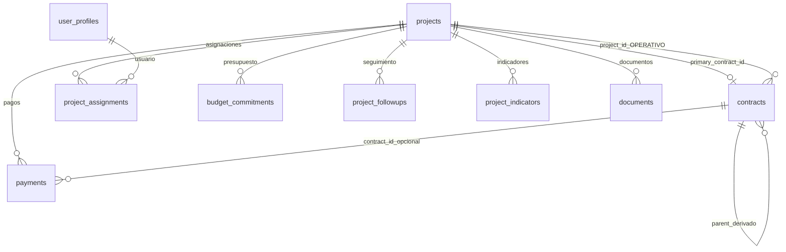

# Documento técnico de evolución arquitectónica
## EPUXUA Gestión Pública — De contratos a proyectos (V3)

**Versión:** 1.1  
**Fecha:** 2026-06-07  
**Estado:** Migración DDL y backfill ejecutados en Supabase  
**Tecnología:** Next.js · TypeScript · Tailwind · Supabase · PostgreSQL · Vercel

---

## Resumen ejecutivo

La evolución introduce **`projects`** como entidad raíz de gestión, mantiene **`contracts`** y la jerarquía `parent_contract_id` para derivados (sin `project_id` en ellos), exige **`project_id` en `payments`**, formaliza la cuota de gerencia (% o valor fijo), migra asignaciones a histórico (`project_assignments`), adopta **SharePoint** para documentos (sin Supabase Storage) y habilita **Kanban** por ciclo de vida.

**Principio rector:** PROYECTO es la unidad de gestión; CONTRATO es el instrumento de ejecución dentro del proyecto.

**Migración:** Aditiva por fases. Scripts V3 ejecutados. Correcciones aplicadas durante despliegue documentadas en [§ 9 Correcciones post-ejecución](#9-correcciones-post-ejecución).

---

# 1. Modelo actual (pre-V3)

## 1.1 Tablas (19 en `public`)

| Grupo | Tablas |
|-------|--------|
| Catálogos | `responsible_areas`, `supervisors`, `contractors`, `paa_lines` |
| Núcleo | `contracts` |
| Hijos contractuales | `interadmin_contract_details`, `invoice_payment_details`, `contract_policies`, `mipymes_stats`, `budget_commitments`, `contract_amendments`, `contract_extensions`, `contract_suspensions`, `payments` |
| Seguimiento / docs | `contract_followups`, `documents` |
| Seguridad | `user_profiles`, `contract_assignments` |
| Auditoría | `audit_log` |

**Vistas legacy:** `v_contract_detail`, `v_dashboard_kpis`, `v_contract_tracking`, `v_contract_alerts`, `v_derived_contracts`

**Roles legacy:** `ADMIN`, `GERENTE`, `ESPECTADOR`

## 1.2 Jerarquía contractual original

```
INTERADMINISTRATIVO (3407-2021)
    └── DERIVADO (CPS-001)  via parent_contract_id
    └── DERIVADO (OPS-003)  via parent_contract_id

DIRECTO + resource_type = FUNCIONAMIENTO (sin padre)
DIRECTO + resource_type = GASTO DE OPERACIÓN COMERCIAL (sin padre)
TIENDA_VIRTUAL / PAGO_FACTURA (sin jerarquía padre-hijo)
```

## 1.3 Fortalezas

- Modelo unificado en `contracts` (interadmin, TV, PCF, directos, derivados)
- Jerarquía `parent_contract_id` operativa
- Triggers de agregados: `sync_paid_value`, `sync_additions_value`, `sync_end_date`
- ~636 contratos, ~2.112 pagos migrados desde Excel
- RLS por rol, auditoría en 7 tablas críticas
- Vistas frontend con joins y campos calculados

## 1.4 Problemas que motivaron V3

| Problema | Impacto |
|----------|---------|
| Entidad central = contrato | Dashboard y menú no reflejan negocio por proyecto |
| Funcionamiento fragmentado | Cientos de DIRECTO sin agrupación proyecto |
| Pagos solo a `contract_id` | Sin rollup financiero a nivel proyecto |
| Cuota gerencia en tabla hija | Sin modelo explícito % vs valor fijo |
| `contract_assignments` | Sin histórico de gerentes |
| Roles insuficientes | Falta DIRECTIVO, CONSULTOR_PROYECTO, GERENTE_PROYECTO |
| Documentos en Storage | Negocio exige SharePoint |
| UI desconectada | Pagos, adiciones, prórrogas en BD pero pestañas vacías |
| Sin Kanban de proyecto | No existe ciclo Planeación → Cerrado |

---

# 2. Modelo objetivo (V3)

## 2.1 Tipos de proyecto

| `project_type` | Origen histórico | Contrato principal | Derivados |
|----------------|------------------|--------------------|-----------|
| `INTERADMINISTRATIVO` | `INTERADMINISTRATIVO` | Sí (el interadmin) | Sí vía `parent_contract_id` |
| `FUNCIONAMIENTO` | `DIRECTO` + `resource_type ≈ FUNCIONAMIENTO` | No obligatorio | No |
| `OPERACION_COMERCIAL` | `DIRECTO` + operación comercial | No obligatorio | No |
| `TIENDA_VIRTUAL` | `TIENDA_VIRTUAL` | No | No |
| `PAGO_FACTURA` | `PAGO_FACTURA` | No | No |

## 2.2 Jerarquía de negocio

```
PROYECTO (projects)
│
├── [opcional] CONTRATO PRINCIPAL (contracts.contract_role = PRINCIPAL)
│       ├── CONTRATO DERIVADO (DERIVADO, parent_contract_id, project_id = NULL)
│       └── ...
│
├── [opcional] CONTRATOS OPERATIVOS (OPERATIVO, project_id directo)
│
├── PRESUPUESTO (budget_commitments.project_id)
├── PAGOS (payments.project_id NOT NULL, contract_id opcional)
├── SEGUIMIENTO (project_followups + contract_followups)
├── DOCUMENTOS (SharePoint URL)
├── ALERTAS (v_project_alerts)
└── INDICADORES (project_indicators)
```

**Regla crítica:** Los derivados **no** llevan `project_id`. Se resuelven por:

```
DERIVADO → parent_contract_id → PRINCIPAL → PRINCIPAL.project_id → PROYECTO
```

## 2.3 ERD objetivo



## 2.4 Entidad `projects`

| Campo | Tipo | Descripción |
|-------|------|-------------|
| `id` | uuid PK | |
| `project_code` | varchar(50) UNIQUE | `3407-2021`, `FUNCIONAMIENTO-2026` |
| `name` | **text** | Nombre UI (ver §9.1 — no varchar(500)) |
| `project_type` | `project_type_enum` | |
| `year` | smallint | |
| `lifecycle_status` | `project_lifecycle_enum` | Kanban |
| `responsible_area_id` | uuid FK | |
| `secretaria` | varchar(255) | Solo interadmin |
| `primary_contract_id` | uuid FK UNIQUE | Contrato principal interadmin |
| `total_value` | numeric(18,2) | Valor total proyecto |
| `goods_services_value` | numeric(18,2) | Bienes y servicios |
| `management_fee_type` | `management_fee_type_enum` | PORCENTAJE \| VALOR_FIJO |
| `management_fee_value` | numeric(18,4) | % o monto base |
| `management_fee_amount` | numeric(18,2) | Cuota calculada |
| `executed_value` | numeric(18,2) | SUM(pagos netos) — trigger |
| `paid_value` | numeric(18,2) | Sincronizado con pagos |
| `available_balance` | numeric GENERATED | `total_value - executed_value` |
| `execution_pct` | numeric GENERATED | `executed / goods_services * 100` |
| `active_alerts_count` | integer | Cache opcional |

## 2.5 Reglas financieras

| Indicador | Regla |
|-----------|-------|
| Valor Total Proyecto | Bienes y servicios + cuota gerencia (según tipo) |
| Valor Bienes y Servicios | `mandate_pool_*` (interadmin) o suma contratos operativos |
| Cuota Gerencia | `PORCENTAJE` (10%, 12%…) o `VALOR_FIJO` (350M, 500M…) |
| Valor Ejecutado | **SUM(payments)** a nivel proyecto — no suma de derivados |
| Valor Pagado | Igual a ejecutado (pagos reales) |
| Saldo Disponible | `total_value - executed_value` |

## 2.6 `project_assignments` (histórico, sin `manager_id`)

| Campo | Descripción |
|-------|-------------|
| `project_id`, `user_id` | FK |
| `assignment_role` | GERENTE_PROYECTO, CONSULTOR_PROYECTO |
| `start_date`, `end_date` | Histórico |
| `active` | Asignación vigente |
| `assigned_by` | Quién asignó |

## 2.7 Roles objetivo

| Rol | Permisos |
|-----|----------|
| `ADMIN` | Acceso total, crear/editar/eliminar |
| `GERENTE_PROYECTO` | Crear/editar en proyectos asignados; no eliminar |
| `DIRECTIVO` | Lectura todos los proyectos (Gerencia General) |
| `CONSULTOR_PROYECTO` | Lectura solo proyectos asignados |

Mapeo transitorio en `current_user_role()`: `GERENTE` → `GERENTE_PROYECTO`, `ESPECTADOR` → `DIRECTIVO`.

## 2.8 Documentos (SharePoint)

La aplicación almacena solo metadatos:

- Nombre documento
- Tipo documento (`document_type_enum`)
- URL SharePoint (`sharepoint_url`)
- URL SECOP (`secop_document_url` / `secop_url`)

**No** usar Supabase Storage (`epuxua-docs` deprecado).

## 2.9 Kanban

Estados `project_lifecycle_enum`:

`PLANEACION` → `CONTRATACION` → `EJECUCION` → `SEGUIMIENTO` → `LIQUIDACION` → `CERRADO`

Tarjeta muestra: código, nombre, valor total, bienes/servicios, cuota gerencia, % ejecución, alertas activas.

## 2.10 Menú objetivo

```
Dashboard
Proyectos (Vista General · Kanban · Calendario)
Contratación (Principal · Derivados · Supervisión)
Financiero (Presupuesto · Pagos · Facturación)
Documentos · Alertas · Indicadores
Administración (Usuarios · Configuración)
```

Expediente proyecto: Resumen · Estructura Contractual · Financiero · Seguimiento · Documentos · Indicadores · Alertas.

---

# 3. Plan de migración (ejecutado)

## 3.1 Estrategia: Strangler Fig

```
Fase 0: DDL aditivo ✅
Fase 1: Backfill datos ✅
Fase 2: Triggers y vistas ✅
Fase 3: Frontend proyecto (pendiente)
Fase 4: RLS por proyecto (parcial)
Fase 5: Deprecación legacy (futuro)
```

## 3.2 Tablas conservadas

Las 19 tablas originales + `auth.users`. **Ninguna eliminada.**

## 3.3 Tablas creadas

| Tabla | Estado |
|-------|--------|
| `projects` | ✅ Creada y poblada |
| `project_assignments` | ✅ Creada |
| `project_followups` | ✅ Creada |
| `project_indicators` | ✅ Creada |
| `migration_log` | ✅ Creada (trazabilidad backfill) |

## 3.4 Tablas modificadas

| Tabla | Cambios aplicados |
|-------|-------------------|
| `contracts` | `project_id`, `contract_role`, `chk_derivado_no_project` |
| `payments` | `project_id` NOT NULL |
| `budget_commitments` | `project_id` |
| `documents` | `project_id`, `sharepoint_url`, `secop_document_url` |
| `user_role_enum` | + GERENTE_PROYECTO, DIRECTIVO, CONSULTOR_PROYECTO |

## 3.5 Tablas a eliminar eventualmente (Fase 5+)

- `contract_assignments` (cuando RLS use solo `project_assignments`)
- Columnas Storage en `documents`

## 3.6 Reglas de backfill aplicadas

| Origen | Regla |
|--------|-------|
| `INTERADMINISTRATIVO` | 1 proyecto = 1 interadmin; `PRINCIPAL`; financiero desde `interadmin_contract_details` |
| `DIRECTO` + funcionamiento | Proyecto `FUNCIONAMIENTO-{year}`; contratos `OPERATIVO` |
| `DIRECTO` + operación comercial | Proyecto `OPERACION-COMERCIAL-{year}` |
| `TIENDA_VIRTUAL` | Proyecto `TIENDA-VIRTUAL-{year}` |
| `PAGO_FACTURA` | Proyecto `PAGO-FACTURA-{year}` |
| `DIRECTO` restante | Proyecto `DIRECTO-{year}` (catch-all) |
| `DERIVADO` | `contract_role = DERIVADO`; `project_id` NULL |
| `payments` | `project_id = resolve_project_id(contract_id)` |
| Asignaciones | `contract_assignments` → `project_assignments` |

---

# 4. Impacto frontend

## 4.1 Páginas actuales → objetivo

| Actual | Objetivo |
|--------|----------|
| `/` | Dashboard por proyecto |
| `/contracts` | `/proyectos` |
| `/contratos-derivados` | `/proyectos/[id]/estructura` |
| `/contracts/[id]` | `/proyectos/[id]` expediente |
| `/seguimiento` | `/proyectos/kanban` |
| `/alertas` | Alertas por proyecto |
| Rutas fantasma sidebar | Implementar o ocultar |

## 4.2 Rutas objetivo

```
/dashboard
/proyectos
/proyectos/kanban
/proyectos/calendario
/proyectos/[id]
/proyectos/[id]/estructura
/proyectos/[id]/financiero
/proyectos/[id]/seguimiento
/proyectos/[id]/documentos
/proyectos/[id]/indicadores
/proyectos/[id]/alertas
/contratacion/principal
/contratacion/derivados
/financiero/presupuesto
/financiero/pagos
/financiero/facturacion
/documentos
/alertas
/indicadores
/administracion/usuarios
/administracion/configuracion
```

## 4.3 Componentes

| Componente | Acción |
|------------|--------|
| `Sidebar.tsx` | Nuevo árbol navegación |
| `DashboardPage.tsx` | Fuente `v_project_dashboard` |
| `contracts-grid` | → `projects-grid` |
| `contract-detail` | → `project-expediente` |
| **Nuevo** `contract-tree.tsx` | Árbol PRINCIPAL → DERIVADO |
| **Nuevo** `project-kanban.tsx` | Columnas lifecycle |
| `contract-tabs` | Conectar pagos/adiciones/prórrogas a BD |
| **Nuevo** `project-assignment-manager` | Histórico gerentes |

## 4.4 Servicios

| Servicio | Responsabilidad |
|----------|-----------------|
| `projects.service.ts` | CRUD proyectos, Kanban, expediente |
| `project-assignments.service.ts` | Asignaciones históricas |
| `project-financial.service.ts` | Presupuesto, pagos |
| `contracts.service.ts` | Estructura contractual en proyecto |
| `documents.service.ts` | Metadatos SharePoint |

---

# 5. Impacto Supabase

## 5.1 ENUMs nuevos

```sql
project_type_enum: INTERADMINISTRATIVO, FUNCIONAMIENTO, OPERACION_COMERCIAL, TIENDA_VIRTUAL, PAGO_FACTURA
project_lifecycle_enum: PLANEACION, CONTRATACION, EJECUCION, SEGUIMIENTO, LIQUIDACION, CERRADO
contract_role_enum: PRINCIPAL, DERIVADO, OPERATIVO
management_fee_type_enum: PORCENTAJE, VALOR_FIJO
project_assignment_role_enum: GERENTE_PROYECTO, CONSULTOR_PROYECTO
```

## 5.2 Funciones

| Función | Uso |
|---------|-----|
| `resolve_project_id(uuid)` | Proyecto desde cualquier contrato (recursivo en derivados) |
| `user_has_project(uuid)` | RLS gerente/consultor |
| `sync_project_executed_value()` | Trigger post-pago |
| `calc_management_fee_amount()` | Cuota según tipo |
| `current_user_role()` | Extendida con mapeo legacy |

## 5.3 Vistas V3

| Vista | Propósito |
|-------|-----------|
| `v_project_detail` | Expediente completo |
| `v_project_dashboard` | KPIs globales |
| `v_project_kanban` | Tarjetas Kanban |
| `v_project_contract_tree` | Árbol principal → derivados |
| `v_project_financial` | Presupuesto + pagos + saldos |
| `v_contract_detail` | **Mantenida** durante transición |

## 5.4 Índices clave

```
idx_projects_code, idx_projects_type, idx_projects_lifecycle, idx_projects_year
idx_contracts_project, idx_contracts_role
idx_payments_project, idx_payments_proj_date
idx_pa_project, idx_pa_user (WHERE active)
idx_doc_project
```

## 5.5 RLS

| Tabla | ADMIN | GERENTE_PROYECTO | DIRECTIVO | CONSULTOR_PROYECTO |
|-------|-------|------------------|-----------|---------------------|
| `projects` | ALL | SELECT/UPDATE asignado | SELECT all | SELECT asignado |
| `payments` | ALL | CRUD vía `user_has_project` | SELECT all | SELECT asignado |
| Derivados | — | Acceso vía proyecto del padre | idem | idem |

## 5.6 Auditoría

Extendida a: `projects`, `project_assignments`, `project_followups`, `project_indicators` mediante `audit_trigger_fn`.

---

# 6. Riesgos

| Riesgo | Mitigación aplicada |
|--------|---------------------|
| `name` varchar(500) vs objeto largo | `ALTER name TYPE text` + nombre UI acotado |
| Pagos sin `project_id` | Proyectos catch-all TV/PCF/DIRECTO + `resolve_project_id` |
| Derivados huérfanos (187-2025, 194-2025) | `EPUXUA_FIX_PARENT_REFS.sql` |
| Doble conteo financiero | `executed_value` solo desde `payments.project_id` |
| RLS rompe producción | Vistas duales + mapeo roles legacy |
| CDP/CRP duplicados | Pendiente reconciliación presupuesto |

---

# 7. Scripts SQL V3

> **Estado:** Ejecutados en Supabase. Referencia para reproducción o nuevos entornos.  
> Orden: 7.1 → 7.2 → 7.3 → 7.4 → 7.5 → 7.6 → 7.7 → 7.8 → correcciones §9 → 7.9

## 7.1 `EPUXUA_V3_01_ENUMS.sql`

```sql
CREATE TYPE project_type_enum AS ENUM (
  'INTERADMINISTRATIVO', 'FUNCIONAMIENTO', 'OPERACION_COMERCIAL',
  'TIENDA_VIRTUAL', 'PAGO_FACTURA'
);
CREATE TYPE project_lifecycle_enum AS ENUM (
  'PLANEACION', 'CONTRATACION', 'EJECUCION',
  'SEGUIMIENTO', 'LIQUIDACION', 'CERRADO'
);
CREATE TYPE contract_role_enum AS ENUM ('PRINCIPAL', 'DERIVADO', 'OPERATIVO');
CREATE TYPE management_fee_type_enum AS ENUM ('PORCENTAJE', 'VALOR_FIJO');
CREATE TYPE project_assignment_role_enum AS ENUM ('GERENTE_PROYECTO', 'CONSULTOR_PROYECTO');

ALTER TYPE user_role_enum ADD VALUE IF NOT EXISTS 'GERENTE_PROYECTO';
ALTER TYPE user_role_enum ADD VALUE IF NOT EXISTS 'DIRECTIVO';
ALTER TYPE user_role_enum ADD VALUE IF NOT EXISTS 'CONSULTOR_PROYECTO';
```

## 7.2 `EPUXUA_V3_02_PROJECTS.sql`

```sql
CREATE TABLE projects (
  id                      uuid PRIMARY KEY DEFAULT gen_random_uuid(),
  project_code            varchar(50)  NOT NULL,
  name                    text NOT NULL,  -- text, NO varchar(500)
  project_type            project_type_enum NOT NULL,
  year                    smallint NOT NULL CHECK (year BETWEEN 2020 AND 2099),
  lifecycle_status        project_lifecycle_enum NOT NULL DEFAULT 'EJECUCION',
  responsible_area_id     uuid REFERENCES responsible_areas(id),
  secretaria              varchar(255),
  primary_contract_id     uuid,
  total_value             numeric(18,2) NOT NULL DEFAULT 0 CHECK (total_value >= 0),
  goods_services_value    numeric(18,2) NOT NULL DEFAULT 0 CHECK (goods_services_value >= 0),
  management_fee_type     management_fee_type_enum,
  management_fee_value    numeric(18,4),
  management_fee_amount   numeric(18,2) NOT NULL DEFAULT 0,
  executed_value          numeric(18,2) NOT NULL DEFAULT 0,
  paid_value              numeric(18,2) NOT NULL DEFAULT 0,
  available_balance       numeric(18,2) GENERATED ALWAYS AS (total_value - executed_value) STORED,
  execution_pct           numeric(7,4) GENERATED ALWAYS AS (
    CASE WHEN goods_services_value > 0
      THEN ROUND(executed_value / goods_services_value * 100, 4) ELSE 0 END
  ) STORED,
  active_alerts_count     integer NOT NULL DEFAULT 0,
  observations            text,
  created_at              timestamptz NOT NULL DEFAULT now(),
  updated_at              timestamptz NOT NULL DEFAULT now(),
  CONSTRAINT uq_project_code UNIQUE (project_code)
);

CREATE INDEX idx_projects_type ON projects (project_type);
CREATE INDEX idx_projects_lifecycle ON projects (lifecycle_status);
CREATE INDEX idx_projects_year ON projects (year);

CREATE TRIGGER trg_projects_upd
  BEFORE UPDATE ON projects FOR EACH ROW EXECUTE FUNCTION set_updated_at();

CREATE TABLE project_assignments (
  id               uuid PRIMARY KEY DEFAULT gen_random_uuid(),
  project_id       uuid NOT NULL REFERENCES projects(id) ON DELETE CASCADE,
  user_id          uuid NOT NULL REFERENCES user_profiles(id) ON DELETE CASCADE,
  assignment_role  project_assignment_role_enum NOT NULL,
  start_date       date NOT NULL DEFAULT CURRENT_DATE,
  end_date         date,
  active           boolean NOT NULL DEFAULT true,
  assigned_by      uuid REFERENCES user_profiles(id),
  created_at       timestamptz NOT NULL DEFAULT now()
);

CREATE UNIQUE INDEX uq_project_assign_active
  ON project_assignments (project_id, user_id, assignment_role) WHERE active = true;
```

## 7.3 `EPUXUA_V3_03_ALTER_CONTRACTS.sql`

```sql
ALTER TABLE contracts
  ADD COLUMN IF NOT EXISTS project_id    uuid REFERENCES projects(id),
  ADD COLUMN IF NOT EXISTS contract_role contract_role_enum;

CREATE INDEX idx_contracts_project ON contracts (project_id) WHERE project_id IS NOT NULL;
CREATE INDEX idx_contracts_role ON contracts (contract_role);

ALTER TABLE projects
  ADD CONSTRAINT fk_projects_primary_contract
  FOREIGN KEY (primary_contract_id) REFERENCES contracts(id);

ALTER TABLE contracts
  ADD CONSTRAINT chk_derivado_no_project
  CHECK (contract_role IS DISTINCT FROM 'DERIVADO' OR project_id IS NULL);
```

## 7.4 `EPUXUA_V3_04_ALTER_PAYMENTS_DOCUMENTS.sql`

```sql
ALTER TABLE payments ADD COLUMN IF NOT EXISTS project_id uuid REFERENCES projects(id);
ALTER TABLE budget_commitments ADD COLUMN IF NOT EXISTS project_id uuid REFERENCES projects(id);
ALTER TABLE documents
  ADD COLUMN IF NOT EXISTS project_id uuid REFERENCES projects(id),
  ADD COLUMN IF NOT EXISTS sharepoint_url text,
  ADD COLUMN IF NOT EXISTS secop_document_url text;

-- project_followups, project_indicators (ver DDL completo en despliegue)
```

## 7.5 `EPUXUA_V3_05_FUNCTIONS.sql`

```sql
CREATE OR REPLACE FUNCTION resolve_project_id(p_contract_id uuid)
RETURNS uuid LANGUAGE plpgsql STABLE AS $$
DECLARE
  v_proj uuid; v_parent uuid; v_depth int := 0;
BEGIN
  SELECT project_id, parent_contract_id INTO v_proj, v_parent
  FROM contracts WHERE id = p_contract_id;
  IF NOT FOUND THEN RETURN NULL; END IF;
  IF v_proj IS NOT NULL THEN RETURN v_proj; END IF;
  IF v_parent IS NOT NULL THEN
    LOOP
      v_depth := v_depth + 1;
      IF v_depth > 10 THEN RETURN NULL; END IF;
      SELECT project_id, parent_contract_id INTO v_proj, v_parent
      FROM contracts WHERE id = v_parent;
      IF NOT FOUND THEN RETURN NULL; END IF;
      IF v_proj IS NOT NULL THEN RETURN v_proj; END IF;
      EXIT WHEN v_parent IS NULL;
    END LOOP;
  END IF;
  RETURN NULL;
END;
$$;

CREATE OR REPLACE FUNCTION sync_project_executed_value()
RETURNS trigger LANGUAGE plpgsql AS $$
DECLARE v_pid uuid;
BEGIN
  v_pid := COALESCE(NEW.project_id, OLD.project_id);
  IF v_pid IS NULL THEN RETURN COALESCE(NEW, OLD); END IF;
  UPDATE projects SET
    executed_value = COALESCE((SELECT SUM(gross_value - deductions) FROM payments WHERE project_id = v_pid), 0),
    paid_value     = COALESCE((SELECT SUM(gross_value - deductions) FROM payments WHERE project_id = v_pid), 0)
  WHERE id = v_pid;
  RETURN COALESCE(NEW, OLD);
END;
$$;

CREATE TRIGGER trg_sync_project_executed
  AFTER INSERT OR UPDATE OR DELETE ON payments
  FOR EACH ROW EXECUTE FUNCTION sync_project_executed_value();

CREATE OR REPLACE FUNCTION user_has_project(p_project_id uuid)
RETURNS boolean LANGUAGE plpgsql STABLE SECURITY DEFINER AS $$
BEGIN
  RETURN EXISTS (
    SELECT 1 FROM project_assignments
    WHERE project_id = p_project_id AND user_id = auth.uid() AND active = true
      AND (end_date IS NULL OR end_date >= CURRENT_DATE)
  );
END;
$$;
```

## 7.6 `EPUXUA_V3_06_BACKFILL.sql`

Ver §9 para versión corregida. Bloques principales:

1. Interadmin → `projects` (nombre: secretaría + objeto, `name` tipo `text`)
2. Vincular `PRINCIPAL` + `primary_contract_id`
3. Funcionamiento / Operación comercial por año
4. Tienda virtual / Pago factura / DIRECTO catch-all por año
5. Derivados: solo `contract_role = DERIVADO`
6. `payments.project_id = resolve_project_id(contract_id)`
7. `budget_commitments`, `project_assignments`

## 7.7 `EPUXUA_V3_07_VIEWS.sql`

Vistas: `v_project_detail`, `v_project_kanban`, `v_project_dashboard`, `v_project_contract_tree` con `security_invoker = true` y `GRANT SELECT TO authenticated`.

## 7.8 `EPUXUA_V3_08_RLS.sql`

RLS en `projects`, `project_assignments`, `project_followups`, `project_indicators`. Mapeo legacy en `current_user_role()`.

## 7.9 `EPUXUA_V3_09_CONSTRAINTS_FINAL.sql`

```sql
-- Solo ejecutar cuando:
SELECT COUNT(*) FROM payments WHERE project_id IS NULL;  -- debe ser 0

ALTER TABLE payments ALTER COLUMN project_id SET NOT NULL;

-- Auditoría en tablas nuevas
-- CREATE TRIGGER trg_audit_* ON projects, project_assignments, ...
```

---

# 8. Roadmap

## Fase 0 — Preparación ✅

Backup, DDL aditivo, validación huérfanos.

## Fase 1 — Backfill ✅

Proyectos creados, pagos con `project_id`, triggers financieros, vistas V3.

## Fase 2 — Frontend proyecto (en curso)

| # | Entregable |
|---|------------|
| 2.1 | `project.ts` + `projects.service.ts` |
| 2.2 | `/proyectos` + `/proyectos/kanban` |
| 2.3 | `/proyectos/[id]` expediente |
| 2.4 | `contract-tree.tsx` |
| 2.5 | Pestañas pagos/adiciones conectadas a BD |
| 2.6 | Dashboard dual durante transición |

## Fase 3 — Financiero, documentos, alertas

Presupuesto, pagos, SharePoint, indicadores, calendario.

## Fase 4 — Seguridad y roles

RLS proyecto en producción, UI asignaciones, roles definitivos.

## Fase 5 — Deprecación

Redirigir `/contracts` → `/proyectos`, deprecar `contract_assignments`, limpiar Storage.

---

# 9. Correcciones post-ejecución

## 9.1 Error `varchar(500)` en backfill interadmin

**Síntoma:** `22001: value too long for type character varying(500)`  
**Causa:** `contracts.object` supera 500 caracteres (ej. `3431-2021` con 1.028 chars).

**Corrección:**

```sql
ALTER TABLE projects ALTER COLUMN name TYPE text;
```

**Nombre recomendado para UI:**

```sql
COALESCE(NULLIF(trim(icd.secretaria), ''), c.contract_number)
  || ' — ' || left(c.object, 200)
```

El objeto completo permanece en `contracts.object`.

## 9.2 Error `23502` en `payments.project_id NOT NULL`

**Síntoma:** `column "project_id" of relation "payments" contains null values`  
**Causa:** Backfill inicial no cubrió TV, PCF, DIRECTO restante ni derivados sin cadena de padre resoluble.

**Corrección — proyectos catch-all:**

```sql
-- TIENDA_VIRTUAL por año
INSERT INTO projects (project_code, name, project_type, year, lifecycle_status)
SELECT 'TIENDA-VIRTUAL-' || year, 'Tienda Virtual ' || year,
  'TIENDA_VIRTUAL'::project_type_enum, year, 'EJECUCION'::project_lifecycle_enum
FROM contracts WHERE contract_type = 'TIENDA_VIRTUAL' GROUP BY year
ON CONFLICT (project_code) DO NOTHING;

UPDATE contracts c SET project_id = p.id, contract_role = 'OPERATIVO'::contract_role_enum
FROM projects p WHERE c.contract_type = 'TIENDA_VIRTUAL'
  AND p.project_code = 'TIENDA-VIRTUAL-' || c.year AND c.project_id IS NULL;

-- PAGO_FACTURA por año (misma lógica con 'PAGO-FACTURA-')
-- DIRECTO restante por año (misma lógica con 'DIRECTO-')

UPDATE payments SET project_id = resolve_project_id(contract_id) WHERE project_id IS NULL;

-- Validar antes de 7.9:
SELECT COUNT(*) FROM payments WHERE project_id IS NULL;  -- = 0
```

## 9.3 Derivados huérfanos

Contratos `187-2025`, `194-2025` sin padre (falta interadmin `364-2025` en Excel).  
Ejecutar `EPUXUA_FIX_PARENT_REFS.sql` y validar cadena antes de asignar pagos.

## 9.4 Queries de validación post-migración

```sql
-- Proyectos por tipo
SELECT project_type, COUNT(*) FROM projects GROUP BY 1 ORDER BY 2 DESC;

-- Pagos resueltos
SELECT COUNT(*) AS total,
       COUNT(*) FILTER (WHERE project_id IS NOT NULL) AS con_proyecto
FROM payments;

-- Contratos sin proyecto (excl. derivados)
SELECT contract_type, contract_role, COUNT(*)
FROM contracts
WHERE project_id IS NULL AND contract_role IS DISTINCT FROM 'DERIVADO'
GROUP BY 1, 2;

-- Coherencia financiera
SELECT p.project_code, p.executed_value,
       COALESCE(SUM(pay.gross_value - pay.deductions), 0) AS suma_pagos
FROM projects p
LEFT JOIN payments pay ON pay.project_id = p.id
GROUP BY p.id, p.project_code, p.executed_value
HAVING p.executed_value IS DISTINCT FROM COALESCE(SUM(pay.gross_value - pay.deductions), 0);
```

---

# 10. Referencias

| Archivo | Propósito |
|---------|-----------|
| `EPUXUA_DDL.sql` | Esquema base v2 |
| `EPUXUA_VIEWS_GRANTS.sql` | Permisos vistas legacy |
| `EPUXUA_FIX_PARENT_REFS.sql` | Corrección vínculos padre derivados |
| `EPUXUA_CONTRACT_HIERARCHY_*.sql` | Enum DERIVADO + reclasificación |
| `EPUXUA_USER_PROFILES_AUTO.sql` | Perfiles automáticos |
| `clean_data/parte_*.sql` | Importación Excel histórica |

---

*Documento generado como referencia arquitectónica V3. La aplicación Next.js aún consume principalmente vistas legacy (`v_contract_detail`); la Fase 2 del roadmap conectará el frontend al modelo proyecto.*
